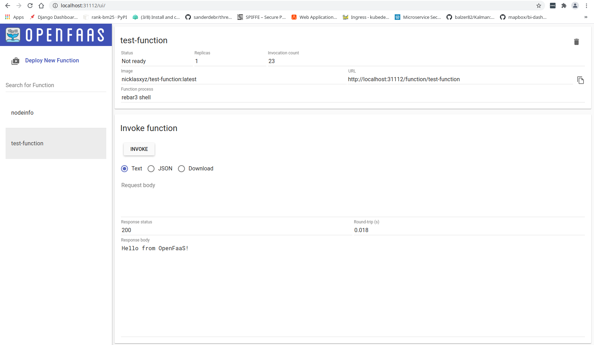

# OpenFaaS Gleam function templates

This repository contains [OpenFaaS](https://github.com/openfaas) function templates for writing serverless functions in [Gleam](https://github.com/gleam-lang/gleam).

## Usage

1. Make sure OpenFaaS has been deployed to your Kubernetes cluster and the OpenFaaS CLI tool has been installed. See [here](./OpenFaaS.md) for a breif introduction on how to easily do this.
2. Download the Gleam function templates from this repo:
```bash
faas-cli template pull https://github.com/nicklasxyz/gleam_openfaas#main
```
3. Create a new function:
``` bash
faas-cli new --lang gleam test-function
```
Note: This essentially creates a usual Gleam project stucture, but with a pre-defined module name and files. It is important that the module and file names in this project is not changed as these are eventually imported as local dependencies by a parent module.

4. Add new functionality to the function that is going to be deployed and managed by OpenFaaS:
``` bash
vi test-function/src/function.gleam
# ... Extend or add whatever you want to the 'handler' function.  
```
5. Make sure a valid container registry, to where functions can be pushed, has been defined in the `test-function.yml` file:
``` bash
vi test-function.yml
```
6. Finally, build, push and deploy the image:
```
# Authenticate with OpenFaaS (assuming kubectl is used with the k3s Kubernetes distribution):
PASSWORD=$(k3s kubectl -n openfaas get secret basic-auth -o jsonpath="{.data.basic-auth-password}" | base64 --decode) && \
echo "OpenFaaS admin password: $PASSWORD"
faas-cli login --gateway http://localhost:31112 --password=$PASSWORD

# Build and deploy:
faas-cli build -f test-function.yml
faas-cli push -f test-function.yml
faas-cli deploy -f test-function.yml # --gateway=http://localhost:31112

# Or just:
faas-cli up -f test-function.yml

# To remove function deployments run:
faas-cli remove -f test-function.yml
```
7. Wait a few seconds, then we can invoke the function by simply calling:
```bash
curl http://localhost:31112/function/test-function; echo

# If nothing was changed in 'function.gleam' file before deployment, then we should just see the default message:
>> Hello from OpenFaaS!
```

## Acknowledgements

The general webserver setup is taken from [this repository](https://github.com/Willyboar/weby) by [Willyboar](https://github.com/Willyboar).